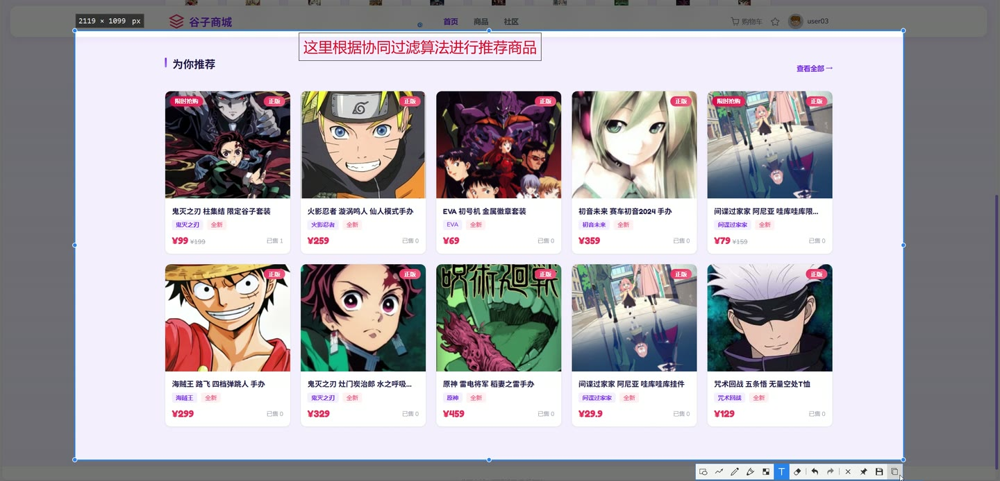
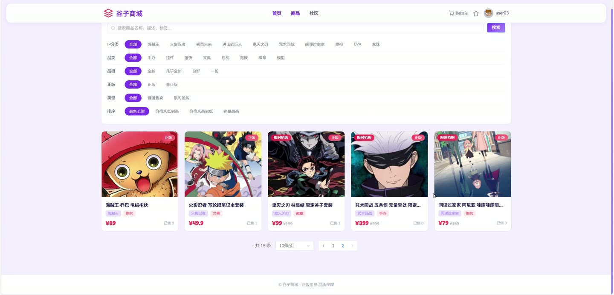
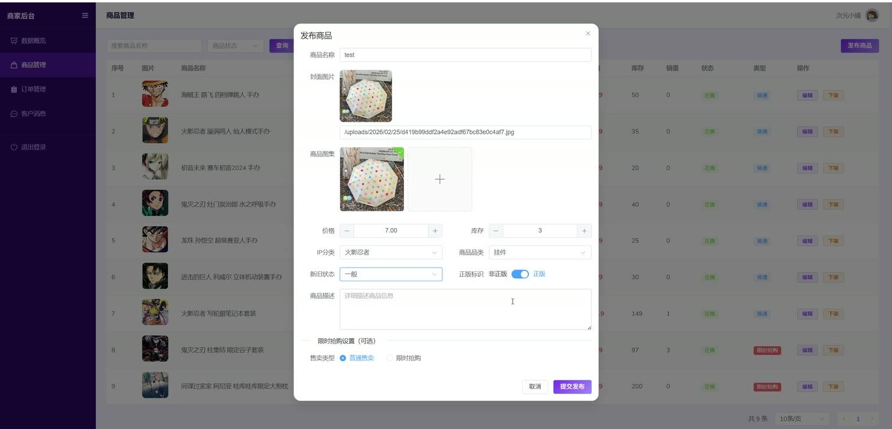
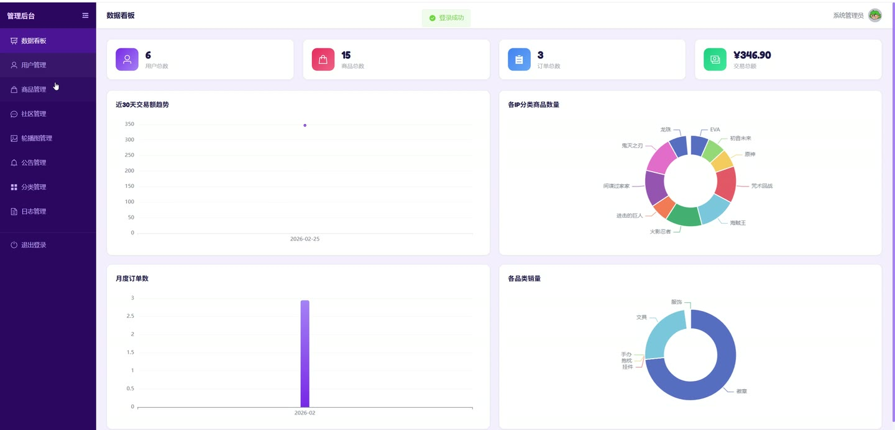

# (附文档)Springboot3+Vue3+MySQL 二次元周边商城

**技术栈**：Springboot3、Vue3、MySQL

### 系统简介

本系统是一个前后端分离的二次元周边商城，支持多角色（普通用户、商家、管理员）协同操作。用户可浏览商品、加购下单、参与限时抢购、发表社区帖子、私信聊天；商家可管理商品、处理订单；管理员负责审核商品与帖子、管理轮播图、公告及分类。
 
### 核心功能
 
### 用户端

 
- 注册与登录：支持用户名、手机号注册，登录后返回 JWT Token 及用户信息。 
- 商品浏览：按关键词、IP 分类、商品品类、品相、正版、售卖类型、价格区间多维度筛选，支持按价格/销量/时间排序。 
- 商品详情：查看商品主图、价格、库存、描述、标签、真实收藏数，每次访问自动增加浏览量。 
- 个性化推荐：基于内容推荐 + 协同过滤 + 热门兜底的混合算法，未登录用户返回热门商品。 
- 购物车：添加商品到购物车（自动合并相同商品数量）、更新数量、删除商品，列表展示商品信息。 
- 收藏商品：一键收藏/取消收藏，收藏列表分页展示商品信息。 
- 下单购买：支持从购物车批量下单或直接购买，选择收货地址、填写备注，自动扣减库存。 
- 限时抢购：抢购商品使用 Redis 原子扣减库存 + 分布式锁，支持每人限购数量控制。 
- 订单管理：查看订单列表（按状态筛选）、订单详情、模拟支付、确认收货、取消订单（待付款）、申请退款（已完成）。 
- 收货地址：添加、编辑、删除地址，支持设置默认地址（自动取消其他默认）。 
- 社区帖子：发布帖子（需审核）、编辑帖子（重新审核）、删除帖子、按关键词搜索帖子列表、查看帖子详情（含关联商品）。 
- 点赞与评论：对帖子点赞/取消点赞，发表评论（支持回复），评论列表展示用户信息。 
- 私信聊天：发送消息、获取与某用户的聊天记录、标记消息已读、查看未读消息数、最近聊天联系人列表。 
- 个人中心：查看/编辑个人信息（昵称、头像、简介等）、修改密码。 
- 公告与轮播：查看启用的公告列表、轮播图列表。
 
### 商家端

 
- 商品管理：发布商品（需审核）、编辑商品、下架商品，按关键词/状态筛选商品列表。 
- 订单管理：查看本店订单列表（按状态筛选）、发货（填写快递公司及单号）。 
- 数据统计：查看本店商品统计概览（如商品数、订单数等）。
 
### 管理后台

 
- 商品审核：查看待审核商品列表，审核通过/拒绝商品，下架商品。 
- 帖子审核：查看待审核帖子列表，审核通过/拒绝帖子，隐藏帖子，删除帖子。 
- 分类管理：管理 IP 分类和商品品类（增删改，支持排序）。 
- 轮播图管理：添加、编辑、删除轮播图（支持排序）。 
- 公告管理：发布、编辑、删除公告，分页列表。 
- 操作日志：分页查看操作日志，支持按关键词、操作类型、日期范围筛选。
 
### 技术栈

 后端框架Spring Boot 3 ORMMyBatis-Plus 权限认证JWT + Spring Security 前端框架Vue 3 状态管理Pinia 构建工具Vite 数据库MySQL 缓存Redis HTTP 客户端Axios
 
### 交付内容

 
- 后端完整源码 
- 前端完整源码 
- 数据库初始化脚本 
- 万字文档

## 界面展示

---

## 获取完整源码 + 万字文档

本仓库为项目介绍页。**完整前后端源码、数据库初始化脚本、万字项目文档**，请访问 [codekk.top](http://codekk.top) 获取。

可作课程设计 / 毕业设计参考，支持远程部署调试。